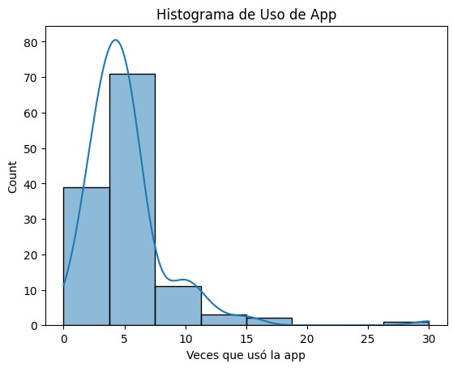
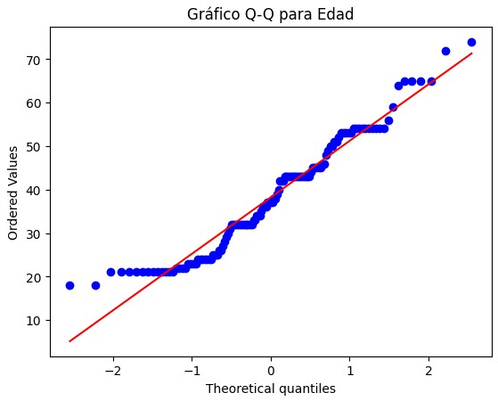

# Customer Churn & Satisfaction Analysis 📊📉

Análisis estadístico inferencial para identificar factores determinantes en la tasa de abandono de clientes (Churn Rate) y su relación con el uso de la aplicación móvil.

### 📓 Archivos del Proyecto
Este repositorio contiene dos versiones del análisis:
* [**📄 Ver Análisis Completo (Con Resultados)**](./analysis_results_full.ipynb) -> **¡Empieza por aquí!** Visualiza todos los gráficos y conclusiones.
* [**📄 Plantilla Limpia (Código)**](./analysis_template.ipynb) -> Versión sin ejecutar, ideal para replicar el estudio desde cero.

---

### 🎯 Objetivos del Estudio
* Evaluar la correlación entre la **frecuencia de uso de la App** y la **fidelidad del cliente**.
* Validar hipótesis mediante pruebas estadísticas rigurosas (**Shapiro-Wilk, D’Agostino & Pearson**).
* Identificar patrones de comportamiento en usuarios propensos a abandonar el servicio.

### 🔍 Hallazgos Estadísticos Visuales
| Histograma Desarrollado | Test de Normalidad (Q-Q Plot) |
| :---: | :---: |
|  |  |
*(El análisis de normalidad confirmó distribuciones no paramétricas en variables clave, guiando la selección de tests posteriores)*

---

### 🛠 Stack Tecnológico
* **Python 3.9+**
* **Pandas & NumPy:** Manipulación y limpieza de datos.
* **Seaborn & Matplotlib:** Visualización de datos (EDA).
* **SciPy Stats:** Pruebas de hipótesis y validación estadística.

### 🚀 Cómo ejecutar localmente
1.  Clona el repositorio.
2.  Instala las dependencias: `pip install pandas seaborn scipy matplotlib`
3.  Abre el archivo `analysis_template.ipynb` en Jupyter Notebook o VS Code.
4.  Carga el dataset ubicado en la carpeta `/data`.

---
**Autor:** Víctor Raquileo Rueda
